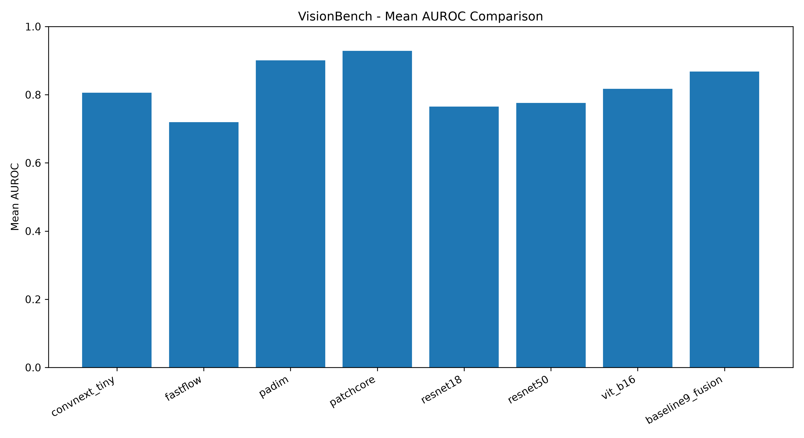

# VisionBench — Benchmarking Vision Models for Industrial Anomaly Detection

VisionBench is a computer vision project for studying and benchmarking different vision-based approaches for industrial anomaly detection.

The project uses the **MVTec AD (Anomaly Detection)** dataset and compares pretrained feature-based models, local-feature anomaly detection methods, and a score-fusion approach.

The primary goal of the project is to understand how different vision architectures and anomaly detection strategies behave across different industrial object categories.

---

## Project Objectives

- Work with a real industrial anomaly detection dataset.
- Build a reproducible MVTec AD data pipeline.
- Establish pretrained vision-model baselines.
- Compare global and local feature-based anomaly detection methods.
- Explore training-based anomaly detection with a DRAEM-style approach.
- Combine multiple anomaly scores using score fusion.
- Evaluate models using image-level AUROC.
- Organize results in a reproducible benchmark format.

---

## Dataset

### MVTec AD

MVTec AD is a real-world industrial anomaly detection dataset containing high-resolution images from multiple object and texture categories.

The dataset contains:

- 15 industrial categories
- Normal training images
- Normal and anomalous test images
- Pixel-level anomaly masks for defective test samples

Categories used in VisionBench:

```text
bottle
cable
capsule
carpet
grid
hazelnut
leather
metal_nut
pill
screw
tile
toothbrush
transistor
wood
zipper

## Benchmark Results

The benchmark compares eight vision/anomaly-detection baselines and a score-fusion approach across the MVTec AD dataset.



The benchmark results are also available in:

`results/final_benchmark_results.csv`

### Mean AUROC

| Method | Mean AUROC |
|---|---:|
| PatchCore | 0.9286 |
| PaDiM | 0.9008 |
| Baseline 9 Fusion | 0.8682 |
| ViT-B/16 | 0.8175 |
| ConvNeXt-Tiny | 0.8062 |
| ResNet50 | 0.7758 |
| ResNet18 | 0.7653 |
| FastFlow | 0.7196 |

> Note: FastFlow and the DRAEM-style training experiment were conducted as limited experimental runs rather than fully optimized training studies. The reported benchmark values should therefore be interpreted in the context of the implemented configurations and compute constraints.